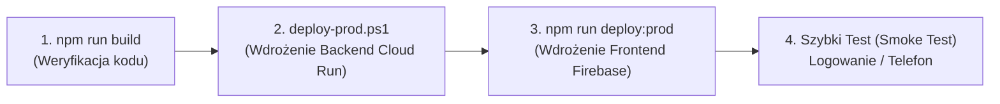

# 📖 Instrukcja Operacyjna: Praca w Środowisku DEV i Wdrażanie na Produkcję (PROD)

Niniejszy przewodnik opisuje zasady bezpiecznej pracy nad aplikacją **BeautyVoice EVA**, gdy na platformie działają już pierwsi aktywni klienci (salony pilotażowe).

---

## 1. Architektura Środowisk: DEV vs PROD

| Element platformy | Środowisko Deweloperskie (DEV) | Środowisko Produkcyjne (PROD) |
| :--- | :--- | :--- |
| **Frontend** | `http://localhost:5173` | `https://beautyvoice-bff.web.app` |
| **Backend API** | `http://localhost:8080` | Google Cloud Run: `beautyvoice-bff` |
| **Baza Danych** | Supabase Dev (lub `?schema=dev`) | Supabase Prod (schemat `public`) |
| **Telefonia / Połączenia** | Numer testowy `+48459568507` / ngrok | Numery zakupione dla salonów |
| **SuperAdmin** | `localhost:5173/superadmin` | `beautyvoice-bff.web.app/superadmin` |
| **PIN SuperAdmina** | `5742` | `5742` |

---

## 2. Jak Bezpiecznie Pracować w Środowisku DEV (Lokalnie)

### A. Uruchamianie aplikacji do codziennego programowania
W dwóch osobnych terminalach uruchamiasz:

```powershell
# Terminal 1: Backend
cd c:\BeautyVoice-BFF\backend-voice
npm run dev

# Terminal 2: Frontend
cd c:\BeautyVoice-BFF\frontend-simulator
npm run dev
```

* Frontend pod `http://localhost:5173` automatycznie przekazuje zapytania `/api` do lokalnego backendu na porcie `8080`.
* Żadne zmiany w kodzie UI nie są widoczne dla klientów salonów, dopóki nie wykonasz komendy wdrożenia.

---

### B. Izolacja Bazy Danych (Ochrona Prawdziwych Rezerwacji)

> [!CAUTION]
> **Złota zasada bazy danych:** Nigdy nie uruchamiaj `npx prisma migrate reset` ani `npx prisma db push --force-reset` na bazie produkcyjnej! Spowodowałoby to bezpowrotne usunięcie salonów i wizyt ich klientów.

Aby lokalnie testować zmiany w bazie bez ryzyka:
1. **Zalecane:** W darmowym planie Supabase utwórz drugi projekt (np. `beautyvoice-dev`).
2. Wklej jego connection string do swojego lokalnego `backend-voice/.env`.
3. Na bazie produkcyjnej połączenie skonfigurowane jest w usłudze Cloud Run.

---

### C. Bezpieczne Testowanie Połączeń Głosowych (Dev Proxy)

> [!IMPORTANT]
> **Zasada nienaruszalności webhooka Zadarma:**
> Główny webhook w Zadarmie (`https://beautyvoice-bff.web.app/api/twilio-incoming`) musi zawsze wskazywać na Cloud Run. **Nigdy nie zmieniaj go w panelu Zadarma na adres ngrok**, ponieważ natychmiast odetniesz połączenia od wszystkich 3 salonów produkcyjnych!

**Jak przetestować rozmowę z EVA lokalnie (np. z nowym promptem)?**
Zastosuj mechanizm **Dev Proxy**, który wdrożyliśmy w Etapie 4:
1. Uruchom lokalny tunel ngrok dla swojego backendu:
   ```powershell
   ngrok http 8080
   ```
   *(skopiuj otrzymany adres, np. `https://abc-123.ngrok-free.app`)*
2. W `backend-voice/.env` na produkcji (lub lokalnie) ustaw:
   ```env
   DEV_FORWARD_URL=https://abc-123.ngrok-free.app
   DEV_TEST_PHONE_NUMBER=+48459568507
   ```
3. **Efekt:** Gdy zadzwonisz na swój numer testowy `+48459568507`, Cloud Run automatycznie przekaże strumień audio do Twojego lokalnego ngroka. Połączenia klientów salonów nadal będą w 100% obsługiwane przez serwer produkcyjny!

---

## 3. Procedura Wdrażania Aktualizacji na Produkcję (PROD)

Wdrożenie wykonujesz w **3 prostych, kontrolowanych krokach**:



---

### Krok 1: Wdrożenie Nowego Backend-u (Cloud Run)

Otwórz PowerShell w folderze `backend-voice` i uruchom dedykowany skrypt:

```powershell
cd c:\BeautyVoice-BFF\backend-voice
.\deploy-prod.ps1
```

**Co robi ten skrypt?**
1. Automatycznie kompiluje TypeScript (`npm run build`). Jeśli wystąpi jakikolwiek błąd w kodzie, proces zostanie zatrzymany – uszkodzony kod **nie ma prawa** trafić na serwer.
2. Pyta o potwierdzenie: `Czy na pewno chcesz wdrożyć wersję produkcyjną? [T/N]`.
3. Bezpiecznie filtruje zmienne z `.env` i publikuje nową rewizję w Google Cloud Run bez przestojów (Zero-Downtime Deployment).

---

### Krok 2: Wdrożenie Nowego Frontendu (Firebase Hosting)

Gdy backend jest gotowy, wdrażasz interfejs użytkownika:

#### Opcja A: Bezpieczny podgląd Staging (Rekomendowane przed dużymi zmianami)
```powershell
cd c:\BeautyVoice-BFF\frontend-simulator
npm run deploy:staging
```
* Otrzymasz unikalny tymczasowy link (np. `https://beautyvoice-bff--staging-xxxx.web.app`).
* Możesz wejść z telefonu lub komputera, przeklikać zmiany i upewnić się, że wszystko wygląda idealnie.

#### Opcja B: Oficjalna publikacja na żywo (PROD)
```powershell
cd c:\BeautyVoice-BFF\frontend-simulator
npm run deploy:prod
```
* Aplikacja zostanie zbudowana i natychmiast zaktualizowana pod głównym adresem `https://beautyvoice-bff.web.app`.

---

### Krok 3: Szybki Test Powdrożeniowy (Smoke Test)

Zaraz po wdrożeniu:
1. Wejdź na `https://beautyvoice-bff.web.app/superadmin` i zaloguj się PINem `5742`.
2. Upewnij się, że lista salonów i wniosków ładuje się poprawnie.
3. Wykonaj krótkie połączenie testowe na numer DEMO (+48343433088) lub numer testowy.

---

## 4. Podsumowanie Zmiennych Środowiskowych

Pełny wzór zmiennych środowiskowych z komentarzami znajduje się w repozytorium w pliku:
👉 [`backend-voice/.env.example`](file:///c:/BeautyVoice-BFF/backend-voice/.env.example)

W razie potrzeby dodania nowej zmiennej (np. nowego klucza zewnętrznego API):
1. Dopisz zmienną do lokalnego pliku `.env`.
2. Uruchom `.\deploy-prod.ps1` – skrypt sam przekaże nowe zmienne do Google Cloud Run.
