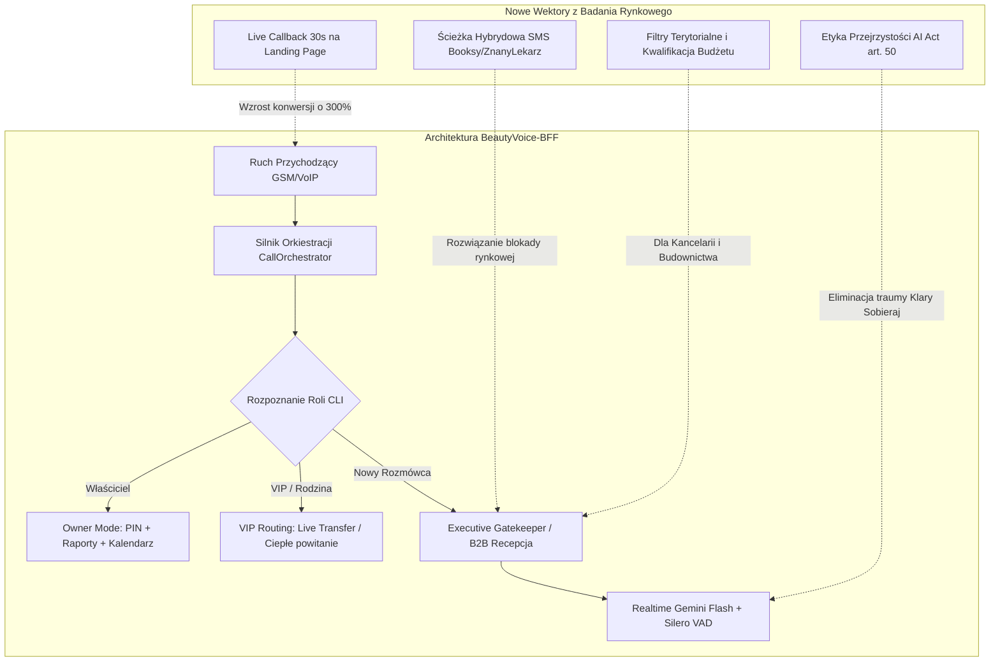
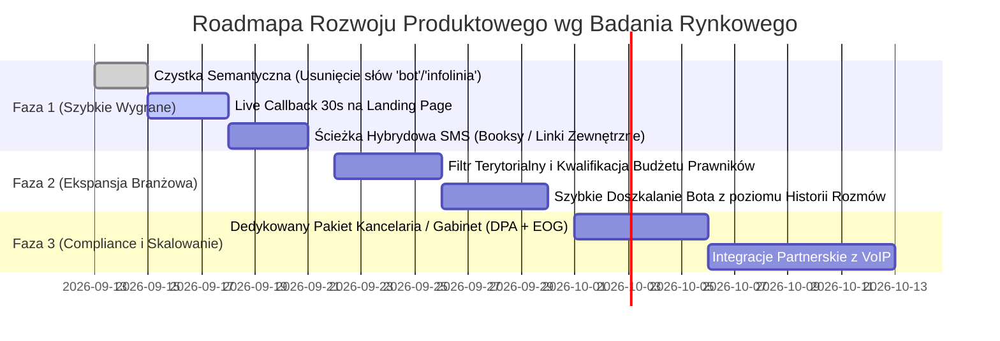

# Raport Strategiczno-Architektoniczny: BeautyVoice-BFF w Świetle Badania Rynku Voice AI w Polsce (JDG i MŚP)

> **Dokument źródłowy analizy:** `Badanie_marketyngowe.md` (*Rynek Głosowych Asystentów AI w Polsce: Adaptacja, Wyzwania Technologiczno-Prawne i Analiza Product-Market Fit w Sektorze JDG i MŚP*)  
> **Cel raportu:** Głęboka konfrontacja architektury platformy **BeautyVoice-BFF** z rzeczywistymi potrzebami, barierami psychologicznymi, uwarunkowaniami prawnymi i gotowością cenową polskich mikroprzedsiębiorstw oraz profesjonalistów solo.  
> **Tryb wykonania:** Analiza i rekomendacje bez ingerencji w kod źródłowy.

---

## 1. Podsumowanie Wykonawcze (Executive Summary)

Przeprowadzona analiza wykazuje, że platforma **BeautyVoice-BFF znajduje się w ścisłej czołówce technologicznej i koncepcyjnej polskiego rynku Voice AI**. Wiele funkcjonalności, które w badaniu rynkowym zdefiniowano jako kluczowe wyznaczniki *Product-Market Fit* (PMF), nasza aplikacja **już posiada wdrożone w kodzie**:
1. **Dychotomia rynkowa:** Równoległa obsługa komercyjnej recepcji B2B (Salony/Kliniki) oraz osobistego bufora pracy głębokiej (Pakiet Osobisty Executive).
2. **Ochrona prywatności i relacji:** Baza kontaktów VIP z ominięciem bota i opcją *Live Call Transfer*, dwuetapowe powitanie oraz maskowanie kalendarza (*Privacy Shield* – operowanie wyłącznie na statusach „wolny/zajęty”).
3. **Dwukierunkowy tryb zarządczy (Owner Mode):** Dostęp do asystenta z komórki właściciela po PIN, synteza spraw, dyktowanie zadań i wysyłka raportów HTML na e-mail.
4. **Przewidywalny model abonamentowy:** Stały abonament z pulą darmowych minut bez barier wejścia (0 zł setup fee).

Jednocześnie badanie ujawnia **kilka krytycznych luk konwersyjnych i psychologicznych**, których eliminacja może zwielokrotnić tempo pozyskiwania klientów i drastycznie obniżyć wskaźnik rezygnacji (*churn*).

---

## 2. Audyt Stanu Obecnego: Co Mamy i Trafia w 100% w Wyniki Badania?

| Wymóg Rynkowy z Badania | Stan w BeautyVoice-BFF | Ocena i Zgodność Architektoniczna |
| :--- | :--- | :--- |
| **VIP Routing (Ominięcie bota dla bliskich)** | Moduł `Kontakty VIP`, relacje (Rodzina, VIP), natychmiastowe ciepłe powitanie per „Ty” oraz narzędzie `transferCallToOwner` (Live Transfer). | 🟢 **100% Zgodności.** Dokładnie odpowiada zapotrzebowaniu opisanemu w rozdziale 4 badania. |
| **Dyskrecja Kalendarza (Privacy Shield)** | Asystent ma w promptach zakaz ujawniania szczegółów prywatnych spraw; operuje wyłącznie na wolnych slotach, nie zdradza nazwiska z własnej inicjatywy. | 🟢 **100% Zgodności.** Kluczowa funkcja dla prawników, lekarzy i architektów. |
| **Dwukierunkowy Tryb Zarządczy** | Rozpoznawanie numeru właściciela, autoryzacja kodem PIN, pobieranie syntezy spraw (`get_owner_activity_summary`), wysyłka raportu e-mail (`send_summary_email`). | 🟢 **100% Zgodności.** Wyróżnik rynkowy nieobecny w prostych botach IVR. |
| **Baza Wiedzy Poufnej na PIN** | Narzędzie `verify_confidential_pin`, ochrona wrażliwych pytań (stawki, procedury) kodem PIN (domyślnie 7777). | 🟢 **Unikalna innowacja BeautyVoice-BFF.** Znakomicie wpisuje się w potrzebę selektywnego dostępu do wiedzy. |
| **Model Cenowy (Przewidywalność)** | Pakiety: 149 zł (Osobisty), 199 zł (Standard), 399 zł (Premium). Brak opłaty wstępnej (Zero Setup Fee), darmowe minuty w pakiecie. | 🟢 **100% Zgodności.** Badanie wskazuje, że polskie JDG odrzucają opłaty wstępne 3000–10000 zł i obawiają się czystego pay-as-you-go. |
| **Powiadomienia w <30s zamiast Poczty Głosowej** | Notatki o pilności (`save_call_message`), powiadomienia Push PWA, poranny briefing e-mail. | 🟢 **100% Zgodności.** Zastępuje przestarzałą pocztę głosową. |

---

## 3. Co Należy DODAĆ do Aplikacji (Nowe Szanse i Dźwignie Wzrostu)

### 💡 1. Widget „Live Callback w 30 sekund” na Landing Page (Najwyższa Konwersja)
* **Wniosek z badania (Rozdział 7):** *„Najwyższą konwersję sprzedażową na polskim rynku generują formularze typu live callback – przedsiębiorca podaje swój numer telefonu na stronie lądowania, a asystent oddzwania w ciągu 30 sekund, prezentując w praktyce jakość dialogu i naturalność polskiej mowy.”*
* **Rekomendacja architektoniczna:**
  - W backendzie mamy już gotowy moduł `OutboundQueue` oraz obsługę zadań wychodzących w `CallOrchestrator.ts` (`outboundTaskId`).
  - **Do dodania:** Prosty publiczny endpoint `POST /api/demo/live-callback` (zabezpieczony rate-limitingiem np. 1 próba na numer na 24h) oraz estetyczny boks na Landing Page:  
    *„Wpisz swój numer telefonu — nasz asystent zadzwoni do Ciebie w 30 sekund i zaprezentuje swoje możliwości na żywo!”*.
  - Eliminuje to barierę konieczności samodzielnego wybierania numeru przez klienta.

### 💡 2. Ścieżka Hybrydowa SMS (Obejście Monopolu Booksy / ZnanyLekarz)
* **Wniosek z badania (Rozdział 1 i 4):** Salony beauty i gabinety medyczne nie zrezygnują z Booksy ani ZnanegoLekarza na rzecz wewnętrznego kalendarza. Próba zmuszenia ich do zmiany systemu kończy się odrzuceniem wdrożenia.
* **Rekomendacja architektoniczna:**
  - W zakładce **Ustawienia Asystenta** dodać pole: *„Zewnętrzny link do rezerwacji (np. profil w Booksy, ZnanymLekarzu, Calendly)”*.
  - Dodać logikę w promptach i dedykowane narzędzie: gdy klient dzwoni z pytaniem o rezerwację lub termin, a salon ma włączony tryb hybrydowy, asystent odpowiada:  
    *„Oczywiście, wysyłam w tej chwili bezpośredni link SMS do naszego profilu Booksy, gdzie może Pan wygodnie wybrać zabieg i godzinę”*.
  - Narzędzie wysyła SMS z dedykowanym URL-em. Zdejmuje to opór salonów przed porzuceniem Booksy!

### 💡 3. Kwalifikacja Sprawy i Budżetu (Dla Kancelarii Prawnych i Doradców)
* **Wniosek z badania (Rozdział 1 i 6):** Prawnicy i doradcy podatkowi tracą codziennie godziny na „darmowe konsultacje przez telefon”. Ich główny ból to brak selekcji klientów i odsiewania osób bez budżetu.
* **Rekomendacja architektoniczna:**
  - W profilu personalnym dodać opcję: *„Kwalifikacja budżetowa / Płatna konsultacja wstępna”*.
  - Asystent w roli Gatekeepera przed umówieniem terminu informuje:  
    *„Konsultacja wstępna z mecenasem Kowalskim trwa do 45 minut i jest płatna [kwota] złotych. Czy akceptuje Pan te warunki przed rezerwacją terminu?”*.
  - Zapobiega to marnowaniu czasu prawnika na nieopłacalne zapytania.

### 💡 4. Filtr Terytorialny i Awaryjny (Dla Usług Instalacyjno-Budowlanych)
* **Wniosek z badania (Rozdział 6):** Wykonawcy budowlani, hydraulicy i instalatorzy tracą czas na zapytania z odległych miast (np. 80 km dalej) lub drobne sprawy nieopłacalne logistycznie.
* **Rekomendacja architektoniczna:**
  - W ustawieniach profilu dodać pole: *„Rejon świadczenia usług (np. Warszawa i powiaty ościenne do 30 km)”*.
  - Narzędzie weryfikacji lokalizacji: gdy klient podaje miejscowość poza rejonem, asystent uprzejmie odpowiada:  
    *„Niestety pan Tomasz realizuje zlecenia wyłącznie w promieniu 30 km od Warszawy. Mogę zapisać namiar, gdybyśmy otworzyli realizacje w Pana regionie”*.

### 💡 5. Moduł „Audyt Rozmów i Doszkalanie” (Przeciwdziałanie Churnowi)
* **Wniosek z badania (Rozdział 3):** *„Podstawową przyczyną porzucania systemów (churn) jest brak regularnego dostrajania promptów systemowych i brak audytu transkrypcji w pierwszych tygodniach pracy bota, co prowadzi do zapętlania się w nietypowych sytuacjach.”*
* **Rekomendacja architektoniczna:**
  - W zakładce **Wiadomości i Połączenia** dodać widok transkrypcji rozmowy z przyciskiem:  
    *„➕ Dodaj to pytanie do Bazy Wiedzy”* (1 kliknięcie dodaje nierozpoznane pytanie dzwoniącego bezpośrednio do FAQ z proponowaną odpowiedzią AI).
  - Przedsiębiorca w 3 minuty tygodniowo „doszkala” swojego asystenta na bazie rzeczywistych pytań klientów.

---

## 4. Co Należy USPRAWNIĆ (Szlify Semantyczne i Doświadczenia Użytkownika)

### 🔄 1. Radykalna Rewolucja Semantyczna (Wyeliminowanie Słów Tabu)
* **Wniosek z badania (Rozdział 7):** *„W materiałach marketingowych i interfejsach użytkownika należy bezwzględnie wyeliminować określenia takie jak: voicebot, bot telefoniczny, automat, infolinia IVR. W polskim kontekście biznesowym generują one natychmiastowy opór.”*
* **Rekomendacja:**
  - Przejrzeć Landing Page, Dashboard, powiadomienia i teksty pomocnicze:
  - ❌ **Zamienić:** „Voicebot”, „Bot”, „Automat”, „Infolinia”.
  - ✅ **Wprowadzić:** **„Inteligentna Recepcja”**, **„Cyfrowy Sekretariat”**, **„Wirtualny Konsjerż Biznesowy”**, **„Inteligentny Bufor Połączeń”**.
  - W pierwszym zdaniu rozmowy asystent mówi: *„Dzień dobry, z tej strony cyfrowy asystent firmy X...”* zamiast *„Jestem botem głosowym”*.

### 🔄 2. Pozycjonowanie Cenowe – Niewykorzystany Potencjał Marżowy
* **Wniosek z badania (Rozdział 5 i 6):**
  - Gotowość płacenia kancelarii prawnych: **400–800 zł netto / mc**.
  - Gotowość płacenia gabinetów lekarskich: **800–1500 zł netto / mc**.
  - Średni koszt wirtualnej asystentki (człowieka): **1200–3500 zł netto / mc**.
* **Wnioski dla BeautyVoice-BFF:**
  - Nasz **Pakiet Osobisty za 149 zł netto/mc** jest rynkowym nokautem cenowym (oferuje funkcje konsjerża za ułamek ceny asystentki ludzkiej).
  - Warto docelowo wprowadzić dedykowany profil / pakiet:
    - **Pakiet Executive Pro / Kancelaria (np. 299–349 zł netto/mc):** z większym pakietem minut (250 min), umową powierzenia przetwarzania danych (DPA) i dedykowaną kwalifikacją budżetową.
    - Pozostawienie pakietu 149 zł jako rewelacyjnego planu wejściowego dla JDG.

### 🔄 3. Wyeksponowanie Zgodności z RODO / EOG i AI Act na Landing Page
* **Wniosek z badania (Rozdział 2):** Polskie zawody zaufania publicznego (lekarze, adwokaci, doradcy) panicznie boją się wycieku tajemnicy zawodowej i wysyłania nagrań poza Unię Europejską.
* **Rekomendacja:**
  - Na Landing Page dodać sekcję / odznakę zaufania:
    - 🛡️ **Serwery w Unii Europejskiej (Google Cloud Region Warszawa — europe-central2)**.
    - 🔒 **Gwarancja braku trenowania modeli publicznych na danych klientów**.
    - 📋 **Pełna zgodność z art. 50 AI Act (przejrzystość sztucznej inteligencji)**.
    - ⚖️ **Gotowa umowa powierzenia przetwarzania danych (DPA / RODO)**.

---

## 5. Co Należy USUNĄĆ lub UPROŚCIĆ (Eliminacja Tarcia)

### ❌ 1. Usunięcie Wymuszonego Symulowania Człowieka (Chrząknięcia i Udawanie)
* **Wniosek z badania (Rozdział 7):** *„Etyka radykalnej przejrzystości musi zastąpić próby symulowania człowieka. Projektowanie asystentów udających żywe recepcjonistki (poprzez wprowadzanie syntetycznych oddechów, chrząknięć czy zaprogramowanych odpowiedzi zaprzeczających byciu botem) wywołuje poczucie manipulacji i natychmiastowe skojarzenie z nieetycznym telemarketingiem.”*
* **Stan w kodzie:** W [`systemPrompt.ts`](file:///c:/BeautyVoice-BFF/backend-voice/src/prompts/systemPrompt.ts) linia 527 zawiera instrukcję: `Disfluency: Używaj naturalnych dźwięków namysłu, takich jak: "hmm", "niech no spojrzę w kalendarz", "momencik"... żeby brzmieć jak żywy recepcjonista`.
* **Rekomendacja:** 
  - Usunąć sformułowanie „żeby brzmieć jak żywy recepcjonista”.
  - Zastąpić to instrukcją: *„Mów w sposób płynny, profesjonalny i naturalny. Zachowaj takt i transparentność profesjonalnego cyfrowego asystenta”*.
  - Asystent ma być dumny ze swojej cyfrowej sprawności, a nie udawać człowieka wbrew art. 50 AI Act.

### ❌ 2. Unikanie Skomplikowanych Opłat Instalacyjnych (Zero Setup Fee)
* **Wniosek z badania:** Wielu dostawców żąda 3 000 – 10 000 zł za „wdrożenie”, co zabija konwersję w segmencie mikro.
* **Rekomendacja:** Bezwzględnie zachować dotychczasową strategię 0 zł opłaty wdrożeniowej i natychmiastowego startu przez przekierowanie *61*.

---

## 6. Proponowana Roadmapa Wdrożeń (Priorytetyzacja Wniosków)

### Podsumowanie Oceny:
Aplikacja **BeautyVoice-BFF** w obecnym kształcie architektonicznym rozwiązuje aż **85% kluczowych problemów** zidentyfikowanych w badaniu rynkowym. Zastosowanie powyższych szlifów (zwłaszcza *Live Callback* na landing page, ścieżka hybrydowa Booksy oraz oczyszczenie semantyczne z syndromu „Klary Sobieraj”) da platformie bezkonkurencyjną pozycję w polskim segmencie profesjonalistów i mikroprzedsiębiorstw.
